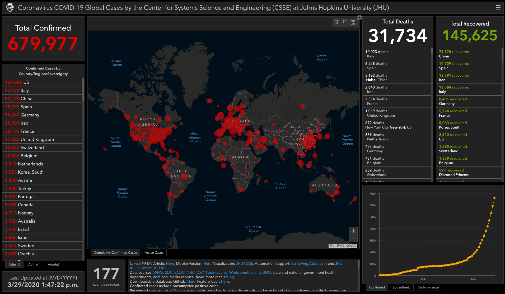
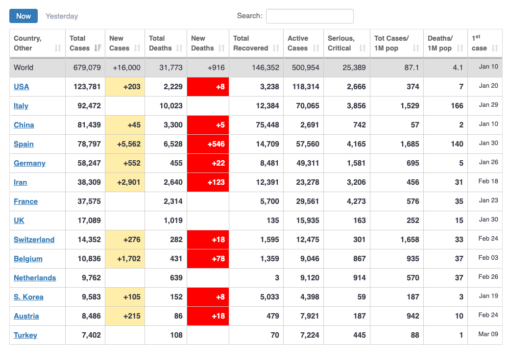

# Covid

[](https://circleci.com/gh/ahmednafies/covid) [](https://codecov.io/gh/ahmednafies/covid)  [](https://pepy.tech/project/covid) 

## Description

Python package to get information regarding the novel corona virus provided
by Johns Hopkins university and worldometers.info

Full Documentation can be found [here](https://ahmednafies.github.io/covid/)


## Requirements

    python >= 3.6

## How to install

    pip install covid

## Dependencies

    pydantic
    requests

## How to use

## John Hopkins University API



### Get All Data

```python
from covid import Covid

covid = Covid()
covid.get_data()
```

#### Result

```python
[
    {
        'id': '53',
        'country': 'China',
        'confirmed': 81020,
        'active': 9960,
        'deaths': 3217,
        'recovered': 67843,
        'latitude': 30.5928,
        'longitude': 114.3055,
        'last_update': 1584097775000
    },
    {
        'id': '115',
        'country': 'Italy',
        'confirmed': 24747,
        'active': 20603,
        'deaths': 1809,
        'recovered': 2335,
        'latitude': 41.8719,
        'longitude': 12.5674,
        'last_update': 1584318130000
    },
    ...
]
```

### List Countries

This comes in handy when you need to know the available names of countries
when using `get_status_by_country_name`, eg. "The Republic of Moldova" or just "Moldova"
So use this when you need to know the country exact name that you can use.

```python
countries = covid.list_countries()
```

#### Result

```python
[
    {'id': '53', 'country': 'China'},
    {'id': '115', 'country': 'Italy'}
    ...
]
```

### Get Status By Country ID

```python
italy_cases = covid.get_status_by_country_id(115)
```

#### Result

```python
{
    'id': '115',
    'country': 'Italy',
    'confirmed': 24747,
    'active': 20603,
    'deaths': 1809,
    'recovered': 2335,
    'latitude': 41.8719,
    'longitude': 12.5674,
    'last_update': 1584318130000
}
```

### Get Status By Country Name

```python
italy_cases = covid.get_status_by_country_name("italy")
```

#### Result

```python
{
    'id': '115',
    'country': 'Italy',
    'confirmed': 24747,
    'active': 20603,
    'deaths': 1809,
    'recovered': 2335,
    'latitude': 41.8719,
    'longitude': 12.5674,
    'last_update': 1584318130000
}
```

### Get Total Confirmed cases

```python
confirmed = covid.get_total_confirmed_cases()
```

### Get Total Deaths

```python
deaths = covid.get_total_deaths()
```

## Getting data from Worldometers.info



```python
covid = Covid(source="worldometers")
```

### Get Data

```python
covid.get_data()
```

#### Result

```python
[
    {
        'country': 'USA',
        'confirmed': 311637,
        'new_cases': 280,
        'deaths': 8454,
        'recovered': 14828,
        'active': 288355,
        'critical': 8206,
        'new_deaths': 2,
        'total_tests': 1656897,
        'total_tests_per_million': Decimal('0'),
        'total_cases_per_million': Decimal('941'),
        'total_deaths_per_million': Decimal('26')
    },
    {
        'active': 1376,
        'confirmed': 81669,
        'country': 'China',
        'critical': 295,
        'deaths': 3329,
        'new_cases': 30,
        'new_deaths': 3,
        'recovered': 76964,
        'total_cases_per_million': Decimal('57'),
        'total_deaths_per_million': Decimal('2'),
        'total_tests': 0,
        'total_tests_per_million': Decimal('0')
    }
    ...
]

```

### Get Status By Country Name

```python
covid.get_status_by_country_name("italy")
```

#### Result

```python
{
    'active': 88274,
    'confirmed': 124632,
    'country': 'Italy',
    'critical': 3994,
    'deaths': 15362,
    'new_cases': 0,
    'new_deaths': 0,
    'recovered': 20996,
    'total_cases_per_million': Decimal('2061'),
    'total_deaths_per_million': Decimal('254'),
    'total_tests': 657224,
    'total_tests_per_million': Decimal('0')
 }
```

### List Countries

```python
countries = covid.list_countries()
```

#### Result

```python
[
    'china',
    'italy',
    'usa',
    'spain',
    'germany',
...
]
```

### Get Total Active cases

```python
active = covid.get_total_active_cases()
```

### Get Total Confirmed cases

```python
confirmed = covid.get_total_confirmed_cases()
```

### Get Total Recovered cases

```python
recovered = covid.get_total_recovered()
```

### Get Total Deaths

```python
deaths = covid.get_total_deaths()
```

## CLI 2.0 (New)

```bash
covid --help
```
### Get all data

#### John Hopkins source (default)

```bash
covid
```

or

```bash
covid -s john_hopkins
```

#### Worldometers source

```bash
covid -s worldometers
```

### List Countries

This comes in handy when you need to know the available names of countries
when using `covid -s 'source' -c 'country_name'`, eg. "The Republic of Moldova" or just "Moldova"
So use this when you need to know the country exact name that you can use.

```bash
covid -s worldometers --list-countries
```

### Get Status By Country Name

```bash
covid -s worldometers -c sweden
```

### Get Total Active cases

```bash
covid -s worldometers -o active
```

### Get Total Confirmed cases

```bash
covid -s worldometers -o confirmed
```

### Get Total Recovered cases

```bash
covid -s worldometers -o recovered
```

### Get Total Deaths

```bash
covid -s worldometers -o deaths
```
